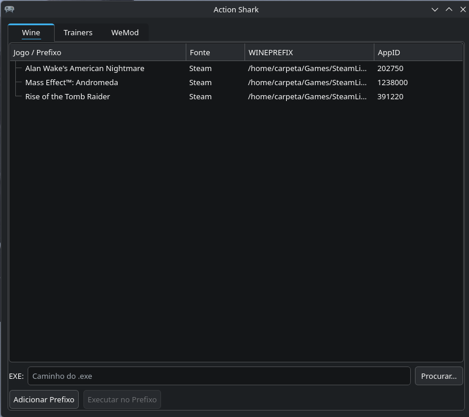

# Action Shark v1.1

Gerenciador gráfico (PyQt6) para executar **trainers** (aplicativos que modificam o comportamento de jogos em tempo de execução, como vidas infinitas, dinheiro infinito, etc.) no Linux usando prefixes Wine/Proton. Detecta automaticamente jogos Steam e de vários launchers, além de integrar o **WeMod** completamente (download, instalação via prefixo pré-configurado, launch e stop).



> **Aviso:** Os arquivos anexados nas releases (ex.: `ProtonCOS11.zip`) são **prefixos Wine/Proton pré-configurados** para uso com o Action Shark. **Não são o aplicativo em si.** O app deve ser clonado ou baixado separadamente do repositório.

## Como funciona

O programa varre o sistema em busca de:

1. **Jogos Steam** via `protontricks -l` + `compatdata/`
2. **Processos Wine/Proton ativos** lendo `/proc/[pid]/environ` e `cmdline`
3. **Prefixes de launchers** lendo arquivos de configuração e pastas conhecidas
4. **Prefixes customizados** adicionados manualmente pelo usuário

Com um prefixo selecionado, você pode executar qualquer `.exe` (trainer) dentro dele com o Wine correto. A aba **Trainers** permite selecionar um prefixo e um trainer para executar diretamente. A guia **WeMod** baixa, instala e gerencia o WeMod no prefixo desejado.

## Funcionalidades

- **Detecção automática** de jogos e prefixes Steam, Lutris, Bottles, Heroic, PortProton, PlayOnLinux, Hydra
- **Execução de trainers** no Wine/Proton correto (detecta o binário wine automaticamente)
- **Seleção de prefixo**: selecione um prefixo e um trainer para executar diretamente na aba Trainers
- **Backup e restore**: salve backups de prefixes e restaure quando necessário
- **Salvar como Prefixo Padrão**: exporte um prefixo como zip em `~/.config/trainer_manager/built_prefixes/`
- **Merge de prefixes**: instale um prefixo padrão sobre um prefixo existente, preservando dados
- **Ocultar prefixos**: oculte prefixos indesejados da lista
- **Remover prefixos**: remova prefixos do disco permanentemente
- **WeMod integrado**: download da versão mais recente, instalação via prefixo pré-configurado, login compartilhado entre prefixes, start/stop
- **Menu de contexto**: copiar WINEPREFIX, abrir pasta, backup, restaurar, salvar como padrão, ocultar, remover

## Launchers suportados

| Launcher | Detecção |
|---|---|
| **Steam** | `protontricks -l` + `compatdata/<appid>/pfx` |
| **Lutris** | `~/.config/lutris/games/*.json` (campo `wine_prefix`) |
| **Bottles** | `~/.var/app/com.usebottles.bottles/data/bottles/` ou `~/.local/share/bottles/` |
| **Heroic Games Launcher** | `~/.config/heroic/config.json` + `GamesConfig/*.json` (Flatpak incluso) |
| **PortProton** | `~/.var/app/ru.linux_gaming.PortProton/data/prefixes/` ou `~/PortProton/prefixes/` |
| **PlayOnLinux** | `~/.PlayOnLinux/wineprefix/` |
| **Hydra** | `~/.config/hydralauncher/wine-prefixes/<appid>/` |
| **WeMod** | Download + instalação integrada com `.desktop` próprio |
| **Custom (Não-Steam)** | `~/.wine`, `~/Games/`, `~/wineprefixes/`, ou adicionados manualmente |

## Distros Linux suportadas

Funciona em **qualquer distribuição Linux** com:

- **Python 3.10+**
- **PyQt6** (`python-pyqt6` no Arch, `python3-pyqt6` no Debian/Ubuntu, etc.)
- **protontricks** (para detecção Steam)
- **Wine / Proton** (para executar os trainers)

Testado em: **CachyOS (Arch Linux)**.

### Dependências (Arch Linux)

```bash
sudo pacman -S python-pyqt6 protontricks wine
```

### Dependências (Debian/Ubuntu)

```bash
sudo apt install python3-pyqt6 protontricks wine
```

### Dependências (Fedora)

```bash
sudo dnf install python3-qt6 protontricks wine
```

## Instalação

```bash
# Clone ou copie os arquivos
cd Linux\ Trainer\ Manager/

# Instale as dependências Python
pip install -r requirements.txt

# Execute diretamente
python3 trainer_manager.py
```

### Instalação com atalhos (recomendado)

```bash
./install.sh
```

O script `install.sh` instala o atalho no menu de aplicações (`~/.local/share/applications/`) e opcionalmente no desktop, ajustando automaticamente o caminho do executável para a pasta atual.

### Desinstalação

```bash
./uninstall.sh
```

Remove os atalhos do menu e desktop, com opção de apagar a pasta de configuração e cache.

## Estrutura

```
Action Shark/
├── trainer_manager.py      # Interface gráfica principal (PyQt6)
├── wemod_manager.py        # Gerenciamento do WeMod (download, instalação, start/stop)
├── wemod_built_prefix.py   # Gerenciamento de prefixes built (merge, download, scan)
├── trainer_manager.desktop # Atalho de menu (.desktop)
├── install.sh              # Script de instalação (atalhos menu + desktop)
├── uninstall.sh            # Script de desinstalação
├── requirements.txt        # Dependências Python
├── LICENSE                 # Licença de uso (Não-Comercial)
└── README.md
```

### Prefixos Built

Prefixos padrão salvos como `.zip` em `~/.config/trainer_manager/built_prefixes/`. Usados para instalar ou restaurar prefixes rapidamente sem download.

## Configuração

O config fica em `~/.config/trainer_manager/config.json`:

```json
{
  "trainers_folder": "/caminho/para/trainers",
  "custom_prefixes": [
    { "name": "Meu Jogo", "wineprefix": "/caminho/do/prefixo" }
  ],
  "hidden_prefixes": []
}
```

## WeMod

**WeMod** é uma plataforma que reúne milhares de trainers para jogos PC em um só lugar, com interface unificada e atualizações automáticas.

A integração utiliza um **prefixo Wine/Proton pré-configurado** (disponível nas releases do repositório) com todas as dependências já instaladas (.NET 4.8, DXVK, VKD3D). Basta baixar o prefixo e importar pelo Action Shark. O login é compartilhado entre prefixes via symlinks.

> **Nota:** O WeMod requer uma conta gratuita ou **Pro** (paga) para funcionar. Crie uma em [wemod.com](https://www.wemod.com).

> **Nota sobre merge em prefixes com launchers secundários (EA App, Ubisoft Connect, etc.):** Ao mesclar o prefixo WeMod em um prefixo que já possui launchers como EA App, o WeMod funcionará corretamente, mas o laucher secundário pode precisar ser reparado (re-executar o installer do laucher). Recomenda-se fazer backup do prefixo antes do merge.

## Licença

Este projeto está licenciado sob uma licença **Custom Não-Comercial** (baseada no MIT).

Permitido:
- Uso pessoal, educacional e de pesquisa
- Modificação e distribuição do código

Vedado:
- Uso comercial (venda, licenciamento, incorporação em produtos comerciais, serviços remunerados)

Consulte o arquivo `LICENSE` para detalhes.

## Créditos

- **Criador:** RCarpetaBR
- **OpenCode:** [opencode.ai](https://opencode.ai) — assistente IA
- **Modelo:** DeepSeek V4 Flash Free
- **WeMod:** [wemod.com](https://www.wemod.com) — plataforma de trainers
- **wemod-launcher:** [DeckCheatz/wemod-launcher](https://github.com/DeckCheatz/wemod-launcher) — version.dll para Electron no Wine
